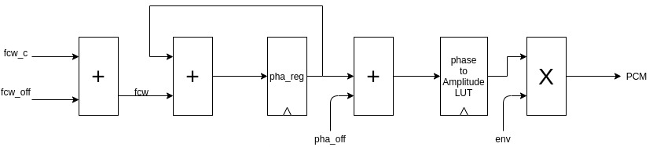
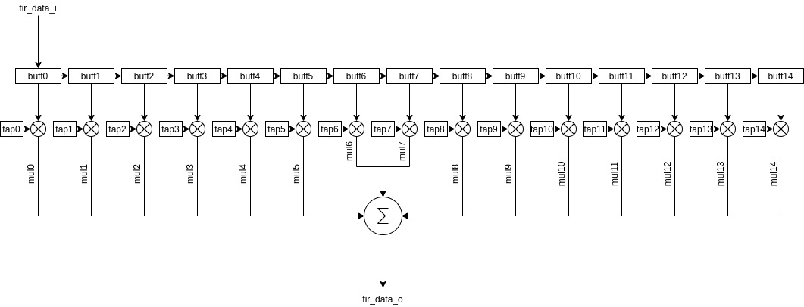
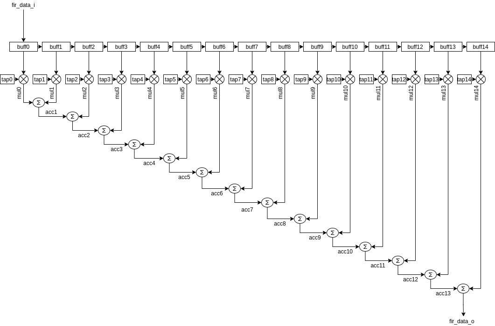

# ddfs
Direct Digital Frequency Synthesizer with FIR low-pass filter

Table of Contents
=================

* [Directory Structure](#directory-structure)
* [DDFS FIR System](#ddfs-fir-system)
  * [DDFS Module](#ddfs-module)
  * [FIR Module](#fir-module)
      
# Directory Structure
<pre>
├── Design
|   ├── ddfs_fir_top.sv
|   |
│   ├── DDFS
│   │   └── ddfs.sv
│   ├── FIR
│   │   └── fir.sv
│   └── ROM
│       ├── sine_rom.mem
│       └── wave_rom.sv
├── Diagrams
│   ├── ddfs.png
│   ├── fir_filter_new.png
│   └── fir_filter.png
├── Software
│   └── main.cpp
└── TestBench
    └── ddfs_tb.sv

</pre>

# DDFS FIR System
- The Direct digital frequency synthesizer (DDFS) and finite impulse response (FIR) filter system has an input clock of 100MHz. However, the FIR low-pass filter samples data at 10MHz, so a Mixed-Mode Clock Manager (MMCM) Module is instantiated to create a 10MHz clock for the FIR filter
- The system also takes the frequency control word for the carrier wave (fcw_c), the frequency control word for the offset frequency(fcw_off), and the phase offset as inputs
  - The frequency control words are calculated as follows: (fdesired / fsystem) * 2N
  - Where the fdesired is the desired frequency for either the carrier or offset and N is the width of the phase 
- The final input is the envelope for the wave
- The output is a 32-bit waveform
- The 16-bit pulse-code modulation (PCM) output of the ddfs module is an input to the FIR low-pass filter.
- The FIR filter outputs the final 32-bit waveform

## DDFS Module
- Inputs:
  - Frequency control word for the carrier wave
  - Offset frequency control word
  - Phase offset
  - envelope
- Output:
  - 16-bit PCM
- The DDFS module converts phases to amplitudes using a look-up table (LUT). The LUT for a sine wave is created in the main.cpp file.
  - The phase in this case is referring to the phases of the wave. The phase register holds the current phase and it is determined by continuously adding the frequency control word (which is the sum of the carrier frequency control word and the offset frequency control word). 
  - The 10 MSBs of the modulated phase are used as the address bits. (10 bits are used since this is the address width)
- The DDFS module is capable of modulating the carrier wave. It does so through the following equation: 
  - <math> A(t) * sin(2π(fc + foff) + phaoff) </math>
  - Where, A(t) is the envelope, fc is the carrier frequency, foff is the offset frequency, and phaoff is the offset phase.

 
## FIR Module
- Inputs:
  - 16-bit PCM value from DDFS module
- Outputs:
  - 32-bit filtered waveform
- The FIR low-pass filter has a passband from 0 - 1MHz and a stopband from 2MHz - 5MHz. 
- The filter samples at a rate of 10MHz
- The filter has a total of 15 taps
- Coefficients were obtained through an online FIR filter design tool (http://t-filter.engineerjs.com/)
- The first design is shown in the following figure:

- This design is straightforward, but since the design is sequential in nature, timing issues may arise at faster sampling rates.
- The design that is used in this project is shown in the following figure:

- Instead of doing the summation at the end with all of the multiplied values, intermediate summations are carried out, making the design more parallel and thus making it less susceptible to timing errors
